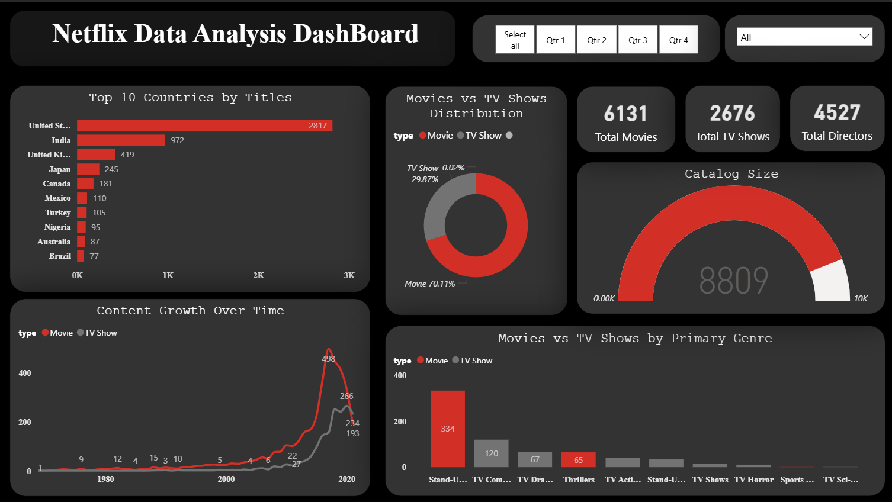

# 🎬 Netflix Dataset Analysis with Pandas

## 📌 Overview
This project analyzes the **Netflix dataset** to uncover insights about movies and TV shows available on the platform.  
Using **Python (Pandas in Jupyter Notebook)**, we explore content distribution, genres, directors, actors, and release trends.  

---

## 📂 Dataset
- Source: [Netflix Titles Dataset (Kaggle)](https://www.kaggle.com/shivamb/netflix-shows)  
- Contains **~8800 entries** of Netflix movies and TV shows.  
- Features include:
  - Title  
  - Type (Movie / TV Show)  
  - Director  
  - Cast  
  - Country  
  - Release Year  
  - Rating  
  - Duration  
  - Genre  

---

## 🔎 Key Insights
✔️ Movies dominate the dataset compared to TV Shows.  
✔️ The United States and India are the top content producers.  
✔️ Dramas, International Movies, and Comedies are among the most common genres.  
✔️ The year with the highest content releases was around 2018–2020.  
✔️ The longest movie in the dataset is identified.  
✔️ Most frequent directors and actors are highlighted.  

---

## 📊 Sample Outputs
(Since no Matplotlib was used, outputs are shown as Pandas tables in Jupyter Notebook.)  

- Movies vs TV Shows count  
- Top 5 countries by content  
- Most popular genres  
- Most frequent directors and actors  
- Year-wise release trends  

---

## 🔮 Future Improvements
- Add **data visualizations** using Matplotlib / Seaborn.  
- ~~Build an **interactive dashboard** with Streamlit or Power BI.~~  
- Perform **sentiment analysis** on descriptions.  
- Compare Netflix dataset with other OTT platforms.  

---

# Netflix Data Analysis & Dashboard

Exploration and visualization of Netflix content trends using Python (Pandas) and Power BI.

## Overview
- **Part 1: Exploratory Data Analysis (Python)**  
  Cleaning and analyzing Netflix dataset to understand content by type, release years, genres, and countries.

- **Part 2: Interactive Dashboard (Power BI)**  
  Visual storytelling of Netflix content trends (2008–2021) with charts, cards, slicers, and KPI visuals.

## Files
| File | Description |
|------|-------------|
| `netflix_titles.csv` | Raw data from Kaggle |
| `Netflix_Titles.ipynb` | Data cleaning and analysis in Jupyter |
| `Netflix Data Analysis Dashboard.pbix` | Power BI interactive dashboard |
| `dashboard.png` | Dashboard preview |

## Preview

## Highlights
- Top 10 countries producing Netflix content
- Distribution: Movies vs TV Shows
- Growth trend of titles over time
- Genre breakdown and key metrics (Total Titles, Total Movies, etc.)

## How to Open
1. Clone this repo  
2. Open `Netflix Data Analysis Dashboard.pbix` with Power BI Desktop  
3. Explore visuals and filters

---

* Show some ⭐ if you liked this project! *

---

## ✅ Conclusion
This project demonstrates how real-world datasets can be analyzed using **Python and Pandas**.  
It builds a foundation for deeper exploration with **visualizations and advanced analytics**.  

---

## 📂 Dataset
The dataset used in this project is [Netflix Movies and TV Shows Dataset](https://www.kaggle.com/datasets/shivamb/netflix-shows).

⚠️ Note: The dataset file (`netflix_titles.csv`) is not included in this repository due to size.  
Please download it manually from Kaggle and place it in the project folder before running the notebook.
